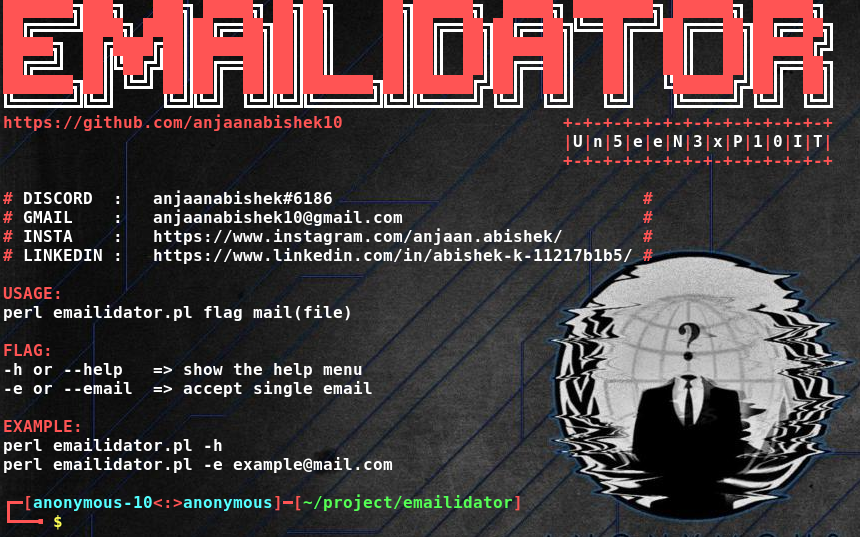
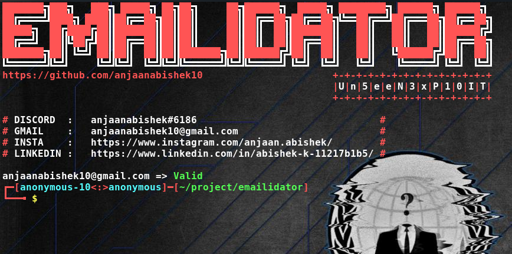

# Emailidator

Check a Email is Valid or Not

NOTE:Can Only Validate 10 Email per Day. To Use More Than 10, You can Restart Your Network Connection and Use again.

<h2> Get Started: </h2>

* sudo apt install perl

* sudo apt install git

* git clone https://github.com/anjaanabishek10/Emailidator.git

* cd Emailidator

<h2> Usage: </h2>

<h3> => perl emailidator.pl -h </h3>

<h3> => perl emailidator -e anjaanabishek10@gmail.com </h3>

